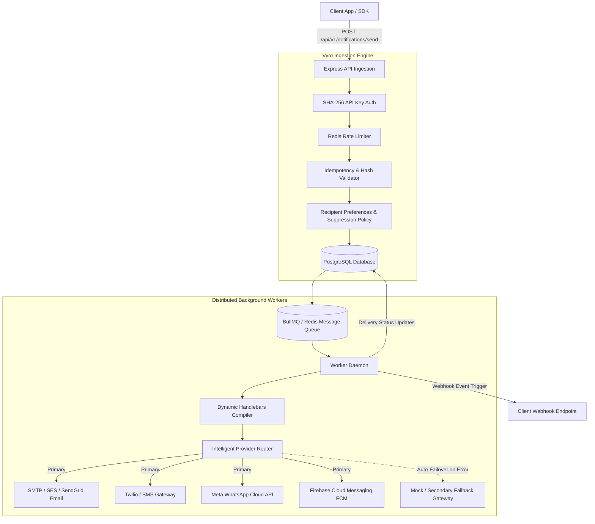

# Vyro — Cloud Notification Platform (NaaS)

> **Enterprise-grade Notification-as-a-Service (NaaS)**: Send transactional & marketing notifications across Email, SMS, WhatsApp, and Mobile Push with high reliability, automated queue workers, intelligent provider failover, dynamic template management, and an ultra-sleek Clerk-inspired developer dashboard.

---

## 1. System Overview & Architecture

Vyro abstracts notification complexity away from customer microservices and web applications into a single, high-throughput unified API and management suite. 

Instead of configuring isolated mailers, SMS gateways, and custom queue retries inside every microservice, client applications issue a single lightweight dispatch request. Vyro handles validation, idempotency, rate limiting, template compilation, background queue execution, provider failover routing, recipient preferences, and webhook callbacks.



---

## 2. Core Capabilities & Feature Matrix

###  High-Throughput Asynchronous Architecture
- **Non-blocking Dispatch**: Dispatches return immediately with HTTP `202 Accepted` and a unique notification ID (`notif_...`) in ~6ms.
- **BullMQ & Redis Queueing**: Heavy I/O, network latency, and third-party provider timeouts never block user-facing APIs.
- **Configurable Worker Concurrency**: Scalable background workers processing jobs with automatic backoff and retry scheduling.

###  Multi-Channel Template Engine
- **Supported Channels**: `EMAIL`, `SMS`, `WHATSAPP`, `PUSH`.
- **Dynamic Handlebars Variables**: Automatically extracts placeholder tokens (e.g. `{{name}}`, `{{companyName}}`, `{{code}}`) in real time.
- **Safe Dry-Run Previews**: Interactive preview endpoint allowing template developers to test variable substitution against mock JSON payloads without executing live deliveries.
- **Custom Sender & Reply-To Routing**: Templates can designate custom sender names, from email addresses (e.g. `Support <support@vyro.io>`), and reply-to headers.

###  Enterprise Security & Multi-Tenancy
- **Organization & Project Boundaries**: Multi-tenant isolation ensuring notifications, keys, and templates remain compartmentalized.
- **SHA-256 API Key Hashing**: Raw secret keys are displayed only once upon generation and hashed before storing in the database.
- **Granular Scopes**: Support for granular permission scopes (e.g., `notifications:write`, `templates:read`, `events:write`).
- **Idempotency Guarding**: Prevents double-sending notifications during network disconnects or client retries via `Idempotency-Key` headers and payload hash caching.

###  Developer Dashboard
- **Monochrome Dark-First Aesthetic**: Deep zinc/black theme (`#09090b`), high-contrast typography (Inter & JetBrains Mono), and crisp micro-interactions.
- **Live Notification Tester**: Interactive dispatch console with dynamic variable fields auto-generated from template parameters.
- **Full Audit Log & Inspector**: Real-time searchable history table with status pills (`SENT`, `DELIVERED`, `PENDING`, `FAILED`, `CANCELLED`, `SUPPRESSED`) and slide-over metadata inspector.
- **API Key & Webhook Manager**: Generate, inspect, and revoke API keys and configure inbound/outbound event delivery endpoints.

---

## 3. Technology Stack

| Layer | Technologies |
| :--- | :--- |
| **Backend API** | Node.js (v18+), Express.js, Prisma ORM, PostgreSQL, Zod validation |
| **Queue & Worker Engine** | Redis 7, BullMQ, Pino Structured Logger |
| **Frontend Web App** | React 18, Vite, Tailwind CSS, Lucide Icons, Axios, React Hot Toast |
| **Email & Delivery Layer** | Nodemailer (Live SMTP & JSON Mock Fallbacks), Provider Failover Engine |
| **Security & Auth** | JWT (Dashboard), SHA-256 (Machine API Keys), bcrypt, Helmet, CORS |

---

## 4. What Is Still Left for 100% Production Readiness

While the platform has a complete end-to-end architecture, real database persistence, queue workers, and a fully functional UI, the following items remain to achieve full enterprise production readiness:

```
┌─────────────────────────────────────────────────────────────────────────────────┐
│                        PRODUCTION READINESS ROADMAP                             │
├───────────────────────────────────────────────────┬─────────────────────────────┤
│ Area                                              │ Status                      │
├───────────────────────────────────────────────────┼─────────────────────────────┤
│ 1. Production SMS & Push Provider Adapters        │ 🟡 Architecture ready (Mock)│
│ 2. Email Deliverability (SPF / DKIM / DMARC)      │ 🟡 Requires domain DNS      │
│ 3. Redis High Availability / Cluster Setup        │ 🟡 Single node configured   │
│ 4. Distributed Multi-Tenant Rate Limiting         │ 🟡 Basic Redis limiter      │
│ 5. APM, Crash Tracking & Telemetry (Sentry)       │ 🔴 Not yet integrated       │
│ 6. End-to-End Automated CI/CD Deployment Pipeline │ 🟡 GitHub Actions skeleton  │
│ 7. Automated Database Migration & Backup Policy   │ 🟡 Manual Prisma deploy     │
└───────────────────────────────────────────────────┴─────────────────────────────┘
```

### Detailed Roadmap Items:

1. **Production Delivery Provider Integrations (SMS, WhatsApp, Push)**:
   - Wire official **Twilio / MessageBird / AWS SNS** credentials for real SMS dispatching.
   - Connect **Meta WhatsApp Cloud API** (System User Token & Phone Number ID) for production WhatsApp templates.
   - Connect **Firebase Cloud Messaging (FCM v1)** and **Apple Push Notification Service (APNs)** with service account JSON keys for mobile push notifications.

2. **Email Deliverability & Domain Authentication**:
   - Transition from individual SMTP relay (Gmail) to dedicated transactional email providers (**Amazon SES, Resend, SendGrid, or Postmark**).
   - Configure **SPF, DKIM, DMARC, and MX records** on the production domain (`vyro.io`) to guarantee 99.9% inbox placement and prevent spam tagging.

3. **High-Availability Queue & Infrastructure Clustering**:
   - Upgrade Redis to a clustered, managed high-availability instance (AWS ElastiCache Redis with Multi-AZ or Upstash Enterprise) with failover replication.
   - Run worker processes across multiple container replicas with CPU/memory autoscaling policies.

4. **Monitoring, Error Tracking & Observability**:
   - Integrate **Sentry** or **Datadog** for real-time frontend and backend uncaught exception tracking.
   - Export Prometheus / OpenTelemetry metrics for queue latency ($p50, p95, p99$ delivery times) and provider error rates.

5. **Security & Production Hardening**:
   - Implement IP allowlisting / CIDR restrictions on machine API keys.
   - Add audit trail logging for human team member actions inside organizations.
   - Enable automated database point-in-time recovery (PITR) and daily automated snapshots.

---

## 5. Repository Structure

```text
Vyro/
├── notification-platform/
│   ├── client/                  # Clerk-style React + Vite Dashboard
│   │   ├── src/
│   │   │   ├── api/             # Unified Axios client & JWT interceptors
│   │   │   ├── components/      # Templates, Notifications, API Keys, Docs
│   │   │   ├── services/        # Real backend API service bindings
│   │   │   └── styles/          # Tailwind & custom dark-theme tokens
│   │   └── package.json
│   │
│   ├── server/                  # Core Express Ingestion & Queue Engine
│   │   ├── prisma/              # Prisma schema & seed migrations
│   │   ├── src/
│   │   │   ├── modules/         # Auth, Templates, Notifications, API Keys
│   │   │   ├── providers/       # Email (Nodemailer), SMS, WhatsApp, Push
│   │   │   ├── queues/          # BullMQ queue producers
│   │   │   └── workers/         # Background worker daemons
│   │   ├── .env.example         # Sanitized configuration template
│   │   └── package.json
│   │
│   ├── sdk/                     # Official Node.js SDK
│   └── docker-compose.yml       # Containerized multi-service orchestration
│
├── .gitignore                   # Root security & build ignore rules
└── README.md                    # Project documentation
```