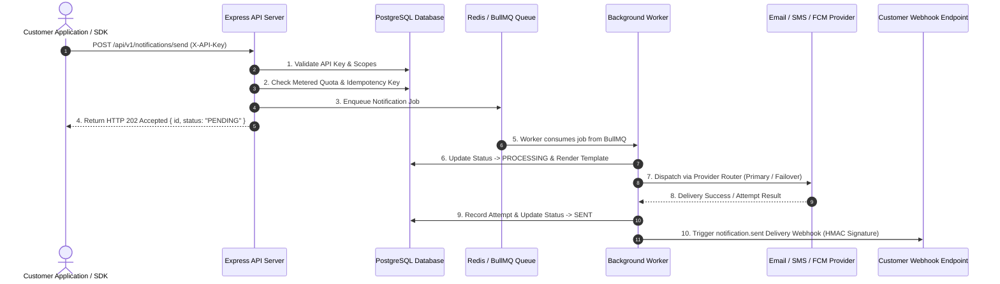

# System Architecture & Design Documentation

## 1. Modular Monolith Architecture
The Notification-as-a-Service (NaaS) platform is structured as a **Modular Monolith** with decoupled process execution for API web traffic and asynchronous queue worker execution.

---

## 2. Core Database Entity Definitions

The platform PostgreSQL schema contains the following core domain entities:

- **`User`**: Account identity supporting bcrypt password authentication and JWT session tokens.
- **`Organization`**: Multi-tenant boundary containing billing subscriptions, rate limits, and team members.
- **`OrganizationMember`**: Join entity mapping users to organizations with RBAC roles (`OWNER`, `ADMIN`, `MEMBER`, `VIEWER`).
- **`Project`**: Logical application context within an organization.
- **`ApiKey`**: SHA-256 hashed machine authentication credentials with fine-grained permission scopes (`notifications:write`, `events:write`, etc.).
- **`Template`**: Multi-channel notification message blueprint with variable placeholders (`{{name}}`).
- **`Notification`**: Primary delivery record tracking channel, recipient, state (`PENDING`, `PROCESSING`, `SENT`, `DELIVERED`, `FAILED`), and attempt history.
- **`NotificationAttempt`**: Detailed delivery attempt log capturing provider responses, HTTP status codes, and failure error messages.
- **`Webhook`**: Customer endpoint subscription for delivery event notifications.
- **`WebhookDelivery`**: Delivery execution record for customer webhooks.
- **`Event`**: Business event tracking record triggering automated notification workflows.
- **`Plan` & `PlanLimit`**: Metered usage quotas and tier configuration (`FREE`, `PRO`, `BUSINESS`).
- **`OrganizationUsage`**: Monthly UTC metered usage accounting (`NOTIFICATIONS`, `EVENTS`, `API_REQUESTS`).
- **`AuditLog`**: Security compliance audit trial tracking administrative operations.

---

## 3. Database Design Patterns & Relational Integrity
- **Primary Keys**: CUID (`cuid()`) strings across all entities for web-friendly unique identifier generation.
- **Foreign Keys**: Explicit relational constraints linking projects, organizations, templates, notifications, and attempts.
- **Unique Constraints**: Unique indexes on `ApiKey.keyHash`, `User.email`, and composite keys (`OrganizationUsage.organizationId_periodStart_metric`).
- **Tenant Isolation**: Every database query explicitly filters by `organizationId` or `projectId` extracted from the authenticated JWT or API Key token context.
- **Cascade Behavior**: Cascading deletions (`onDelete: Cascade`) enforced on dependent child relations (e.g. deleting a project cascades to its API keys).
- **Transactions**: Short-lived Prisma transactions (`prisma.$transaction`) used strictly for atomic operations (e.g. notification creation + quota increment). Network calls to providers are **NEVER** executed inside database transactions.

---

## 4. Asynchronous Queue & Process Boundaries
- **API Process (`src/server.js`)**: Focuses on HTTP request processing, Zod payload validation, authentication, quota checks, and job enqueueing into BullMQ (`notification-queue`, `event-queue`).
- **Worker Process (`src/workers/worker.js`)**: Consumes background jobs, executes provider failover sequences, manages exponential backoff retries, and triggers webhooks independently without impacting HTTP API latency.
