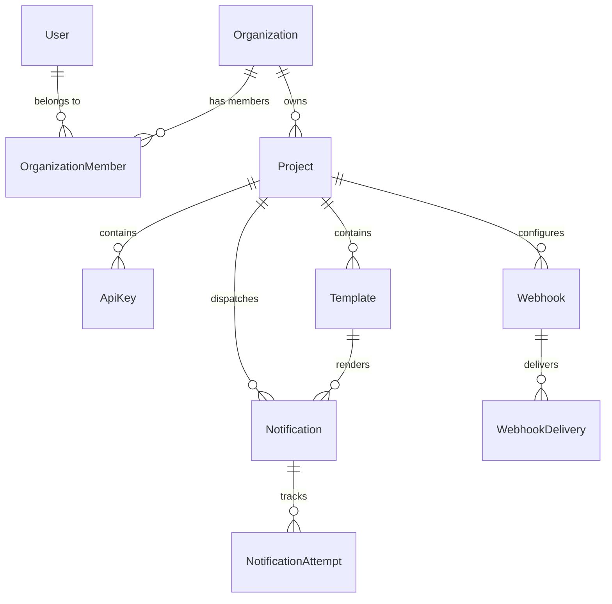

# Database Design & Architecture

## 1. Overview
The Notification Platform (Notification-as-a-Service) uses PostgreSQL as its primary transactional database, managed via Prisma ORM. The schema is designed for multi-tenancy, strict isolation, scalability, efficient delivery history lookups, and auditability.

---

## 2. Multi-Tenancy & Isolation Strategy
The primary tenant boundary is the **Organization**. 

- **Tenant Hierarchy**:
  ```
  User
    ↓
  Organization (Tenant Boundary)
    ↓
  Project
    ↓
  ├── ApiKey
  ├── Template
  ├── Notification ──► NotificationAttempt
  └── Webhook ──► WebhookDelivery
  ```

- **Isolation Enforcement**:
  Every resource in the system belongs directly to an `Organization` (via `Project.organizationId`) or transitively through a `Project`. All service and repository layer queries in subsequent phases MUST include tenant filters (`organizationId` or `projectId`).

---

## 3. Primary Key Strategy
All entities use **UUID (v4)** as primary keys (`String @id @default(uuid())`).

### Why UUIDs over Auto-Increment Integers?
1. **Prevent ID Enumeration Attacks**: Auto-increment IDs (e.g., `/notifications/1024`) expose entity counts and allow attackers to guess or scan IDs across tenants.
2. **Distributed & Microservice Friendly**: UUIDs can be safely generated in application code or client SDKs without round-tripping to a central database sequence.
3. **Multi-Tenant Safety**: Merging data, sharding, or replicating databases across regions carries zero risk of primary key collisions.

---

## 4. Entity Relationships & Schema Summary



### Core Entities List
1. **`User`**: Human dashboard user (`email`, `passwordHash`, `name`).
2. **`Organization`**: Customer/tenant container (`name`, `slug`).
3. **`OrganizationMember`**: Junction entity linking Users to Organizations with roles (`OWNER`, `ADMIN`, `MEMBER`).
4. **`Project`**: Scoped environment under an Organization (`name`, `slug`).
5. **`ApiKey`**: M2M authentication credential (`keyPrefix`, `keyHash`). Raw secrets are never stored.
6. **`Template`**: Multi-channel notification templates (`channel`, `subject`, `body`).
7. **`Notification`**: Single notification dispatch record (`channel`, `recipient`, `status`, `metadata`).
8. **`NotificationAttempt`**: Granular attempt record for delivery retries (`provider`, `status`, `errorCode`, `errorMessage`).
9. **`Webhook`**: Webhook endpoint subscription (`url`, `secret`, `active`).
10. **`WebhookDelivery`**: Webhook delivery dispatch attempt (`eventType`, `payload`, `status`, `responseStatus`).

---

## 5. Unique Constraints & Tenant Scoping

| Entity | Unique Fields | Scoping | Purpose |
| :--- | :--- | :--- | :--- |
| `User` | `email` | Global | Unique login identifier across platform |
| `Organization` | `slug` | Global | Unique URL slug for tenant management |
| `OrganizationMember` | `[organizationId, userId]` | Composite | Prevents adding the same user twice to an organization |
| `Project` | `[organizationId, slug]` | Organization-Scoped | Allows different organizations to use identical project slugs (e.g. `production`) |
| `ApiKey` | `keyHash` | Global | Fast key authentication lookup & uniqueness guarantee |
| `Template` | `[projectId, name]` | Project-Scoped | Template names are unique within a project, not globally |

---

## 6. Indexing Strategy & Query Rationale

Non-obvious database indexes are added to target critical query paths:

1. **`Notification(projectId, createdAt DESC)`**:
   - *Rationale*: Powers dashboard notification activity feeds ("Get latest 50 notifications for Project X").
2. **`Notification(projectId, status)`**:
   - *Rationale*: Enables fast filtering in dashboard UI by notification status (e.g. FAILED, SENT).
3. **`Notification(status)`**:
   - *Rationale*: Optimized polling index for worker queues picking up `PENDING` dispatches across projects.
4. **`NotificationAttempt(notificationId, attemptedAt ASC)`**:
   - *Rationale*: Chronological retrieval of delivery attempt timelines per notification.
5. **`WebhookDelivery(status, nextRetryAt)`**:
   - *Rationale*: BullMQ background worker query for pick-up of scheduled webhook retries.
6. **`ApiKey(projectId)` & `Template(projectId, channel)`**:
   - *Rationale*: Fast filtering of channel-specific templates and API key listings per project.

---

## 7. Referential Integrity & Cascade Behavior

| Relation | Cascade Rule | Rationale |
| :--- | :--- | :--- |
| `User` -> `OrganizationMember` | `onDelete: Cascade` | Deleting a user removes membership records, but retains the organization. |
| `Organization` -> `Project` | `onDelete: Cascade` | Deleting an organization removes all projects owned by that tenant. |
| `Project` -> `ApiKey` / `Template` / `Notification` / `Webhook` | `onDelete: Cascade` | Deleting a project cleans up all child infrastructure. |
| `Template` -> `Notification` | `onDelete: SetNull` | **Crucial**: Deleting a template does NOT delete notification dispatch history (`templateId` is set to NULL). |
| `Notification` -> `NotificationAttempt` | `onDelete: Cascade` | Deleting a notification purges its granular attempt history. |
| `Webhook` -> `WebhookDelivery` | `onDelete: Cascade` | Deleting a webhook purges its delivery attempt logs. |

---

## 8. JSON Fields Usage & Rationale

- **`Notification.metadata` (`Json?`)**:
  - *Rationale*: Stores key-value template interpolation variables (e.g. `{"name": "Alice", "orderId": "123"}`) or developer custom tags. Avoids rigid, schema-locked columns.
- **`WebhookDelivery.payload` (`Json`)**:
  - *Rationale*: Event payload structure varies dynamically based on `eventType` (`notification.sent`, `notification.failed`, etc.).

---

## 9. Soft Delete vs Explicit Status Fields
Generic `deletedAt` columns on all tables introduce query overhead and index fragmentation. We use explicit, domain-specific state fields:
- **`ApiKey`**: `revokedAt` (Timestamp indicates key revocation).
- **`Webhook`**: `active` (Boolean status).
- **`Notification`**: `NotificationStatus.CANCELLED`.

---

## 10. Future Schema Extensions (Unimplemented Models)

The following models are documented for future phases and intentionally excluded from Phase 1:

1. **`Event`**:
   - *Future Role*: Event-driven notification architecture mapping client business events (e.g., `ORDER_CREATED`) to templates.
2. **`Schedule`**:
   - *Future Role*: Scheduled & recurring notification dispatches.
3. **`UsageRecord`**:
   - *Future Role*: Metered billing, quota enforcement, and tier usage tracking per organization.
4. **`AuditLog`**:
   - *Future Role*: Security audit logging of organization membership changes, API key creation/revocation, and project settings.

---

## 11. Transaction Boundaries (Future Application Layer)

Operations requiring atomic database transactions in future phases:
1. **Organization Onboarding**:
   - `User` registration + `Organization` creation + `OrganizationMember` (`OWNER` role assignment).
2. **Notification Dispatch**:
   - `Notification` insertion + initial `NotificationAttempt` creation + `UsageRecord` increment.
3. **API Key Generation & Rotation**:
   - Revoke existing `ApiKey` (`revokedAt = now()`) + Insert new `ApiKey`.
